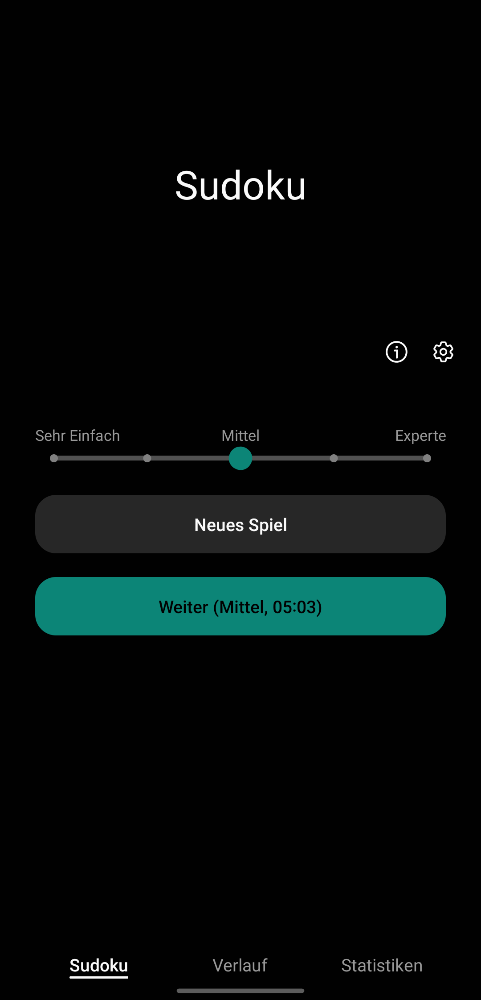
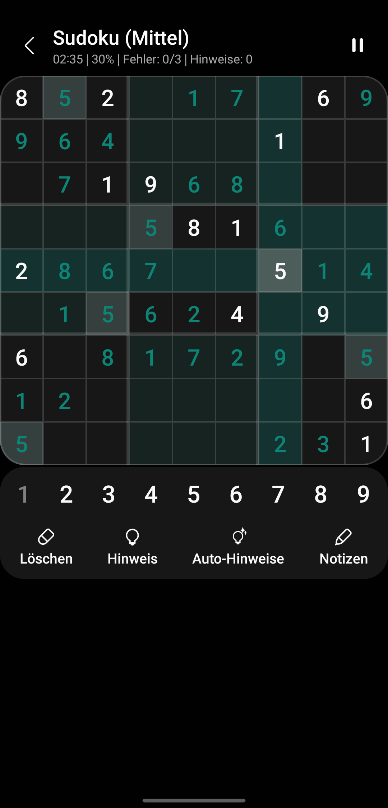
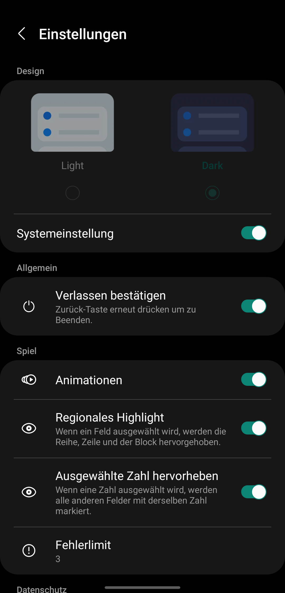

<h2 align="center">
  

</h2>

  
  
  
  

  
  
  
  

   

## More Information: <a target="_blank" href='https://www.leonard-lemke.com/apps/nakbuch'> leonard-lemke.com </a>

 

# NAK Buch (Gesang, Chorbuch, Jugendliederbuch + Erweiterungsheft, ...)

Die neue nicht-offizielle Liederbuch-App der Neuapostolischen Kirche.

Diese App steht in keiner Verbindung zur Neuapostolischen Kirche oder der Verlag Friedrich Bischoff GmbH und beinhaltet lediglich die urheberrechtsfreien Texte aus dem folgenden Büchern:
- Gesangbuch (320 von 438 Liedern)
- Chorbuch (206 von 462 Liedern)
- Jugendliederbuch (41 von 102 Liedern)
- Ergänzungsheft zum Jugendliederbuch (3 von 20 Liedern)

Bei den restlichen Liedern liegen die Rechte noch bei den Urhebern, weshalb diese nicht oder nur teilweise angezeigt werden können. Die Informationen zum Urheberrecht wurden mit großer Sorgfalt geprüft, wenn mir hierbei unwissend Fehler unterlaufen sind, bitte ich freundlichst um einen Hinweis, dem ich unverzüglich nachgehen werde.

Die Verwaltung der Rechte obliegt u.a. der Verlag Friedrich Bischoff GmbH, welche selbst eine (kostenpflichtige) App für das Gesangbuch und eine (kostenpflichtige) App für das Chorbuch herausgegeben hat.

 

## ❓Warum dann diese App benutzen?
 
### 💸 Kostenlos:
Es gibt bereits eine kostenlose Alternative, diese ist aber etwas in die Jahre gekommen und bietet nur grundlegende Funktionen.

### 🎶Inhalte:
Die App vereint nicht nur Gesangbuch und Chorbuch, sondern enthält außerdem noch das Jungedliederbuch und dessen Ergänzungsheft (Weitere in Planung).

### 💎 Design:
Die App wurde nach Samsungs OneUI-Richtlinien entwickelt. Zum Beispiel kann die Titelleiste bei großen Geräten auf jedem Bildschirm "nach unten gezogen werden", um eine angenehme (einhändige) Bedienung der oberen Knöpfe zu gewährleisten. Außerdem hat die App einen "richtigen" Dark-Mode (der sich automatisch den Systemeinstellungen anpasst) und invertiert nicht einfach nur das Textfeld... 😂😅
Android Material Design: Auch hier ist die App einen Schritt vorraus und unterstützt die Smartphone/App-übergreifende Thema-Farbe. (Automatisch vom Hintergrundbild generierte App-Icon-Farbe und Akzent-Farbe der App. Kann auf Samsung-Geräten in den Einstellungen unter "Hintergrundbild und Stil -> Farbpalette" angepasst werden.)

### ⌚ Wear OS Unterstützung: 
Smartphone vergessen? Kein Problem, die Textinhalte der App lassen sich Problemlos (in angenehmem Design) auf der Smartwatch anzeigen.

 

## ✨ Features:
+ Schnell-Einstellung für Stummschalten/Bitte-Nicht-Stören-Modus
+ Angenehme Textansicht
+ Favortiten
+ Notizen
+ Datumsfunktion (Gesungen am...)
+ Integrierte Bildergallerie für Noten (Die App enthält aus urheberrechtlichen Gründen keine Noten und hat außerdem keinen Zugriff auf die Kamera. Die App kann jedoch eine vorinstallierte Kamera-App öffnen und das dort gemachte Foto (komprimiert) in der integrierten Bildergallerie anzeigen.)
+ Verlauf

 

## Informationen zum Datenschutz:
Die App erhebt oder teilt keine Nutzerdaten.

 

---

# NAK Book (Gesang, Chorbuch, Jugendliederbuch + Erweiterungsheft, ...)

The new non-official songbook app of the New Apostolic Church.

This app is in no way affiliated with the New Apostolic Church or Verlag Friedrich Bischoff GmbH and contains only the copyright-free texts from the following books:
- Gesangbuch (320 of 438 songs)
- Chorbuch (206 of 462 songs)
- Jugendliederbuch (41 of 102 songs)
- Ergänzungsheft zum Jugendliederbuch (3 of 20 songs)

For the remaining songs, the rights are still held by the authors, which is why they cannot be displayed or can only be displayed in part. The information on copyright has been checked with great care. If I have unwittingly made mistakes, please let me know and I will follow up immediately.

The administration of the rights is, among others, the responsibility of Verlag Friedrich Bischoff GmbH,
which has itself published a (paid) app for the Gesangbuch and a (paid) app for the Chorbuch.

 

## ❓Why use this app then?
 
### 💸 Free of charge:

There is already a free alternative, but it is a bit outdated and only offers basic features. 

### 🎶Content:

The app not only combines the Gesangbuch and Chorbuch, but also includes the Jugendliederbuch and its Erweiterungsheft (more to come).

### 💎 Design:

The app was developed according to Samsung's OneUI guidelines. For example, the title bar can be "dragged down" on large devices on any screen to ensure comfortable (one-handed) operation of the top buttons. Also, the app has a "proper" dark mode (which automatically adjusts to system settings) and doesn't just invert the text box.... 😂😅
Android Material Design: Again, the app is one step ahead and supports smartphone/app-wide theme color. (App icon color and app accent color automatically generated by the wallpaper. Can be customized on Samsung devices in settings under "Wallpaper and Style -> Color Palette").

### ⌚ Wear OS support: 

Forgotten smartphone? No problem, the text contents of the app can be displayed on your smartwatch (in a pleasant design).

 

## ✨ Features:
+ Quick setting for mute/do not disturb mode.
+ Pleasant text view
+ Favourites
+ Notes
+ Date function (Sung on...)
+ Integrated picture gallery for sheet music (The app does not contain sheet music for copyright reasons and also does not have access to the camera. However, the app can open a pre-installed camera app and display the photo taken there (compressed) in the integrated picture gallery).
+ History

 

## Privacy Information:
The app does not collect or share user data.

 

---

### Stargazers over time

